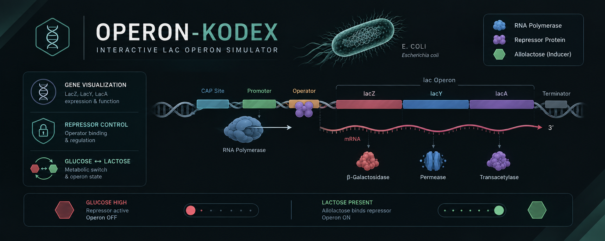

  

# 🧬 Operon-Kodex

### *Interactive Lac Operon Simulator*

> **Operon-Kodex** is an interactive visualization exploring **bacterial gene regulation**, the lac operon, and inducible gene expression through regulatory and metabolic states.
>
> 🧬 **Gene Regulation** · 🦠 **Bacterial Genetics** · 🧪 **Molecular Biology**

**🔬 [Explore the Simulation](YOUR-LINK-HERE)**

---

## ✦ Features

**🧬 Interactive Regulation**  
Explore repressor binding, operator control, and allolactose-mediated induction.

**🔬 Gene Expression Visualization**  
Visualize the regulation and expression of *lacZ*, *lacY*, and *lacA*.

**🧪 Metabolic States**  
Simulate lactose-dependent **ON/OFF** states of the lac operon.

**📱 Responsive Design**  
Optimized for modern desktop and mobile devices.

---

## 🧬 Core Concepts

**Lac Operon · Gene Regulation · Repressor–Operator Interaction · Inducible Expression · Allolactose · Bacterial Genetics**

---

## ⚙️ Technology

**HTML · CSS · JavaScript**

**Repository:** GitHub & Codeberg  
**Hosting:** Cloud flare

---

## 📜 License

Distributed under the **GNU General Public License v3.0 (GPL-3.0)**.
